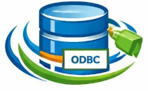

# DatabaseSupport

The DatabaseSupport package provides an [ODBC](https://en.wikipedia.org/wiki/Open_Database_Connectivity) library for Cuis Smalltalk.

## Installing UnixODBC
First, you must install [UnixODBC](https://www.unixodbc.org) on your computer. The installation method varies depending on your operating system.

### Linux
The Smalltalk ODBC package requires the `unixodbc` shared library.

	In this documentation we use a Debian distribution. The procedure should also apply to Debian-based distributions such as Ubuntu. For other Linux distribution types, you’ll need to adapt the procedure.

On Debian-based distributions, use the `apt` package manager. First, to ensure the package repository is up to date, run the following command. 

```bash
sudo apt update
```

Then install the `unixodbc` package:

```bash
sudo apt install unixodbc
```

To help the Smalltalk ODBC package locate the ODBC library, create a symbolic link with this command:

```bash
cd /usr/lib/x86_64-linux-gnu
sudo ln -s libodbc.so.2 libodbc.so
```

### Microsoft Windows
On Windows, the easiest way to install UnixODBC is using [Windows Subsystem for Linux](https://en.wikipedia.org/wiki/Windows_Subsystem_for_Linux). The installation process is the same as for Linux. In that case, you should also use Cuis-Smalltalk for Linux.

### macOS
The recommended way to install UnixODBC in macOS is to use [Homebrew](https://brew.sh).

#### The Homebrew package manager

Use the following command to install the Homebrew package manager on your Mac :

```bash
/bin/bash -c "$(curl -fsSL https://raw.githubusercontent.com/Homebrew/install/HEAD/install.sh)"
```
##### Apple Silicon Macs

In Apple Silicon Macs this should output `/opt/homebrew`. If it outputs a different directory, you will need to uninstall Homebrew and reinstall it.

To verify this, open a terminal and enter `brew --prefix`.

##### Apple Intel Mac

If you used [Homebrew](https://brew.sh) on an Intel Mac and used "Migration Assistant" to migrate to an Apple Silicon Mac, libraries will not be installed in the correct directory.

Uninstalling [Homebrew](https://brew.sh) will delete all the libraries you have already installed. Enter `brew list` before uninstalling [Homebrew](https://brew.sh) to get a list of the currently installed packages so they can be reinstalled after [Homebrew](https://brew.sh) is installed again.

To uninstall [Homebrew](https://brew.sh), enter the following command in a terminal:

```bash
/bin/bash -c "$(curl -fsSL https://raw.githubusercontent.com/Homebrew/install/HEAD/uninstall.sh)"
```

To reinstall [Homebrew](https://brew.sh), browse https://github.com/Homebrew/install, click the link "Homebrew's latest GitHub release", download the file `Homebrew-{version}.pkg`, and double-click that file to install [Homebrew](https://brew.sh).

#### ODBC Shared Library
With MacOS, the Smalltalk ODBC package requires the `libodbc` shared library.

To install this in macOS, enter in a terminal:

```bash
brew install unixodbc
```

With [Homebrew](https://brew.sh), libraries are installed in the `/opt/homebrew/lib` directory.

## Database-specific Drivers
Most databases provide an [ODBC driver](https://www.unixodbc.org/drivers.html). Below you’ll find the installation procedure for the major open-source relational databases. For more specific products such as [Oracle](https://www.oracle.com/database/technologies/releasenote-odbc-ic.html) or [IBM Db2](https://www.ibm.com/docs/en/db2-warehouse?topic=db2-downloading-clients-drivers), we recommend consulting the official documentation.

Download a database-specific driver for each kind of database being used. The installation method varies depending on the operating system used.

### Linux
To access **PostgreSQL** databases, enter `sudo apt install psqlodbc odbc-postgresql` in a terminal. This creates the files `/usr/lib/x86_64-linux-gnu/odbc/psqlodbca.so` and `/usr/lib/x86_64-linux-gnu/odbc/psqlodbcw.so` :

- `psqlodbca.so` is an ANSI driver,
- `psqlodbcw.so` is an Unicode ODBC driver that provides support for special characters (its use is recommended).

To access **MariaDB** databases, enter `sudo apt install odbc-mariadb` in a terminal. This creates the file `/usr/lib/x86_64-linux-gnu/odbc/libmaodbc.so`.

To access **SQLite** databases, enter `sudo apt install libsqliteodbc` in a terminal. This creates the file `/usr/lib/x86_64-linux-gnu/odbc/libsqlite3odbc.so`.

### MacOS
To access **PostgreSQL** databases, enter `brew install psqlodbc` in a terminal. This creates the files `/opt/homebrew/lib/psqlodbca.so` and `/opt/homebrew/lib/psqlodbcw.so` :

- `psqlodbca.so` is an ANSI driver,
- `psqlodbcw.so` is an Unicode ODBC driver that provides support for special characters (its use is recommended).

To access **MariaDB** databases, enter `brew install mariadb-connector-odbc` in a terminal. This creates the file `/opt/homebrew/lib/mariadb/libmaodbc.dylib`. You could create a symbolic link with the following command :

```bash
cd /opt/homebrew/lib
sudo ln -s mariadb/libmaodbc.dylib libmaodbc.dylib
```

To access **SQLite** databases, enter `brew install sqliteodbc` in a terminal. This creates the file `/opt/homebrew/lib/libsqlite3odbc.so`.

## ODBC Data Sources
ODBC requires defining data sources in a text file. The location of these files varies depending on the operating system used. Fortunately, we have ODBC tools to help us declare data sources and verify that the installation is correct.

### UnixODBC tools
The unixodbc package installs the `isql` command which can be used to test data source names (DSNs). This also installs the `odbcinst` command which can be used to output information about the ODBC installation.

On **Debian Linux**, the files `isql` and `odbcinst` exist in the `/usr/bin` directory and are declared in the shell search path.

On **MacOS**, if the files `isql` and `odbcinst` exist in the `/usr/local/bin` directory, delete them so the versions installed by Homebrew will be used instead.

### Where should configuration files be declared?
To determine the directory where this files should reside and the expected file name, enter `odbcinst -j` in a terminal. The example below indicates the locations of configuration files in a Linux distribution.

	unixODBC 2.3.11
	DRIVERS............: /etc/odbcinst.ini
	SYSTEM DATA SOURCES: /etc/odbc.ini
	FILE DATA SOURCES..: /etc/ODBCDataSources
	USER DATA SOURCES..: /home/olivier/.odbc.ini
	SQLULEN Size.......: 8
	SQLLEN Size........: 8
	SQLSETPOSIROW Size.: 8

With macOS, the files are located in different places within the file system.

	unixODBC 2.3.14
	DRIVERS............: /opt/homebrew/etc/odbcinst.ini
	SYSTEM DATA SOURCES: /opt/homebrew/etc/odbc.ini
	FILE DATA SOURCES..: /opt/homebrew/etc/ODBCDataSources
	USER DATA SOURCES..: /Users/olivier/.odbc.ini
	SQLULEN Size.......: 8
	SQLLEN Size........: 8
	SQLSETPOSIROW Size.: 8

Look for "User Data Sources" or "System Data sources" in the output. 

With a user data source, the connection definition is placed in the user's directory, and they are the only one who can use it. On the other hand, a connection statement declared in a system data source is common to all users of the computer.

### Set Up Data Sources
Create a `odbc.ini` file with contents similar to the following, which defines data sources for different types of databases :

    [PetsDSN]
    Description = Postgres database for pets
    Driver = PostgreSQL
    Database = pets
	Servername = localhost
	Port = 5432
    
    [AccountsDSN]
    Description = MariaDB database for accounts
    Driver = MariaDB
    Database = accounts
	Server = localhost
	Port = 3306

    [TodosDSN]
    Description = SQLite database for a Todo app
    Driver = SQLite
    Database = /Users/volkmannm/Documents/dev/lang/smalltalk/Cuis-Smalltalk-Dev-UserFiles/todos.db

The file `odbcinst.ini` associates driver names with paths to their shared libraries. In the `odbc.ini` file above, the `Driver` values is the absolute path to the driver shared library. But using driver names specfied in the `odbcinst.ini` file avoids needing to repeat the shared library paths for each data source that uses the same driver.

The following `odbcinst.ini` file specifies driver shared libraries for PostgreSQL, MariaDB and SQLite.

    [PostgreSQL]
    Description = PostgreSQL ODBC Driver (Unicode)
    Driver = /opt/homebrew/lib/psqlodbcw.so
    Debug=0
	CommLog=1
	UsageCount=1
    
    [MariaDB]
    Description = MariaDB ODBC Driver (Unicode)
    Driver = /opt/homebrew/lib/libmaodbc.dylib	
    Threading=0
	UsageCount=1

    [SQLite]
    Description = SQLite ODBC Driver
    Driver = /opt/homebrew/lib/libsqlite3odbc.so

### Validating configuration files
To list all the registered data sources, enter `odbcinst -q -s`.

To view the details of a specific data source, enter `odbcinst -q -s -n {name}`.

To verify that a data source defined above can be accessed, enter `isql TodosDSN` and `select * from todos;`. Press `ctrl-d` to exit.

## Database Access from Smalltalk
To get the `DatabaseSupport` package, clone the Git repository at [https://github.com/Cuis-Smalltalk/DatabaseSupport](https://example.com) into the same directory where the `Cuis-Smalltalk` directory resides.

> The WeakDictionaries package is required by the FFI package. Unfortunately, it is not provided in the latest stable version of Cuis-Smalltalk (7.6). You can retrieve this package from the 7.5 version repository. The file `WeakDictionaries.pck.st` must be placed in the `Packages/system` folder of your project.

Depending on your operating system, start a Cuis Smalltalk image by entering `./RunCuisOnMacTerminal.sh` or `./RunCuisOnLinux.sh` in a terminal.

> In macOS, this script includes the command which is necessary to allow the Smalltalk ODBC package to find ODBC driver shared libraries:

> ```bash
> export DYLD_LIBRARY_PATH="$(brew --prefix)/lib:${DYLD_LIBRARY_PATH}"
> ```

This script also starts a Smalltalk VM using the base image. To use another image, copy and modify this script.

### Install the DatabaseConnection package
Open an "Installed Packages" window and verify that the ODBC package is installed. If not, open a Workspace, enter `Feature require: 'ODBC'`, and "Do it".

## How to use unit tests ?

This section describes using unit tests to verify the proper functioning of the `DatabaseSupport` package. The instructions below are for Cuis‑Smalltalk in a Linux environment. If you are working on macOS, you must adapt the steps.

If not present, you must install the ODBC driver for SQLite databases. This step differs depending on your operating system. On Linux, use the `apt` command:

    # sudo apt install libsqliteodbc

Create a SQLite database in the folder containing the `DatabaseSupport` package. This database must be named `unit_tests.db`.

    # sqlite3 unit_tests.db

If the ODBC driver for SQLite is not declared in the `odbcinst.ini` file, add the following section :

    [SQLite]
    Description=SQLite ODBC Driver
    Driver=libsqlite3odbc.so
    UsageCount=1

Now declare the data source in the `odbc.ini` file. You must adjust the database path to match where you created it. The configuration file shown here is for Linux.

    [UnitTestsDSN]
    Description = SQLite test database for the DatabaseSupport package
    Driver = SQLite
    Database = /home/olivier/unit_tests.db

## Code snippets
These code snippets are practical and common examples for designing applications that use a relational database.

### A SQL query
```smalltalk
conn := ODBCConnection dsn: 'TodosDSN' user: 'user' password: '1234'.
stmt := conn query: 'select * from todos'.
rs := stmt execute.

rs do: [:row | row print].

conn close.
```

### Get the list of columns of a table
This snippet is a practical example to extract metadata from a SQL object.

```smalltalk
conn := ODBCConnection dsn: 'TodosDSN' user: 'user' password: '1234'.
stmt := conn query: 'select * from todos'.
rs := stmt execute.

'Columns' print.
columns := rs columns.
columns do: [:column | column name print].

conn close.
```

### Parameterized SQL query
Using parameters makes it easier to construct the query by avoiding string concatenation, which can make the code difficult to read and complex to evolve.

```smalltalk
queryStringWithArgs := 'select * from todos WHERE id < ?'.

conn := ODBCConnection dsn: 'TodosDSN' user: 'user' password: '1234'.
rs := conn execute: queryStringWithArgs args: #(5).
rs do: [:row | row print].

conn close.
```

### Prepared Statements
A prepared statement is compiled by the database server. Its execution will be faster if it is reused. 

```smalltalk
queryStringWithArgs := 'select * from todos WHERE id < 10'.

conn := ODBCConnection dsn: 'TodosDSN' user: 'user' password: '1234'.
stmt := conn prepare: queryString.
rs := stmt execute.
rs do: [:row | row print].

conn close.
```

### A prepared statement with parameters
It is recommended to use prepared statements built with parameters to prevent [SQL injections](https://www.w3schools.com/sql/sql_injection.asp).

```smalltalk
queryStringWithArgs := 'select * from todos WHERE id < ?'.

conn := ODBCConnection dsn: 'TodosDSN' user: 'user' password: '1234'.
stmt := conn prepare: queryStringWithArgs.
rs := stmt execute: #(10).
rs do: [:row | row print].

conn close.
```

### Transactions
A transaction is a sequence of one or more operations that are treated as a single unit of work. Transactions ensure that all operations within the block are completed successfully; if any part fails, the transaction can be rolled back, leaving the system in a consistent state. Transactions are typically used in databases to maintain data integrity and consistency.

A transaction block starts with `beginTransaction`. Use `commitTransaction` to validate a transaction or `rollbackTransaction` to cancel one.

```smalltalk
queryString := 'INSERT INTO todo(task) VALUES({1})' format: {'''Buy a coffee'''}.

conn := ODBCConnection dsn: 'TodosDSN' user: 'user' password: '1234'.
conn beginTransaction.
stmt := conn query: queryString .
rs := stmt execute.
conn commitTransaction.

conn close.
```
